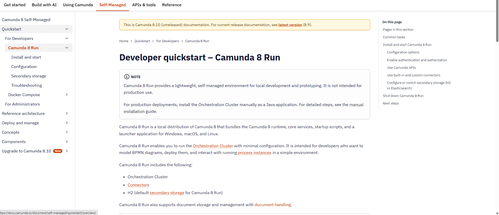
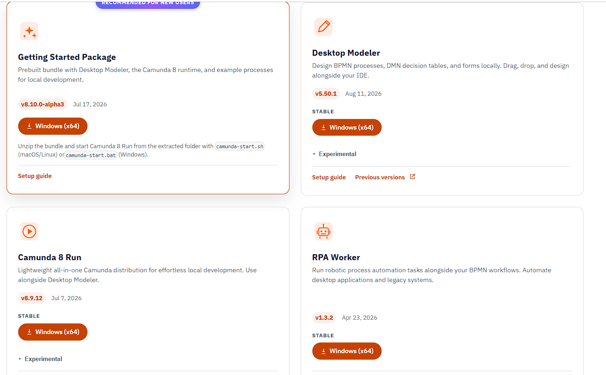
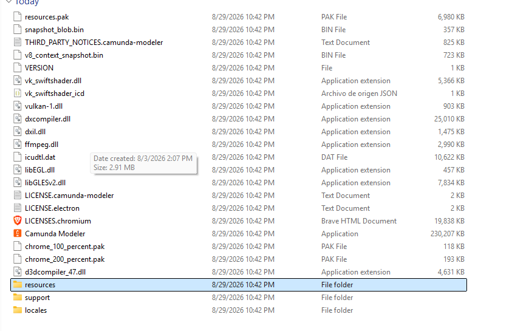
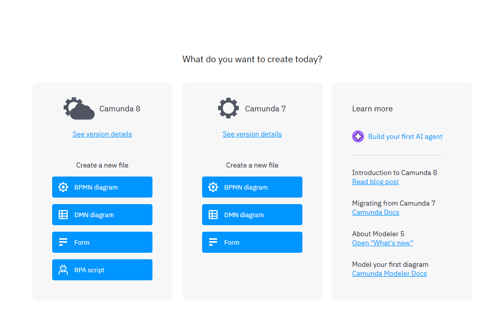
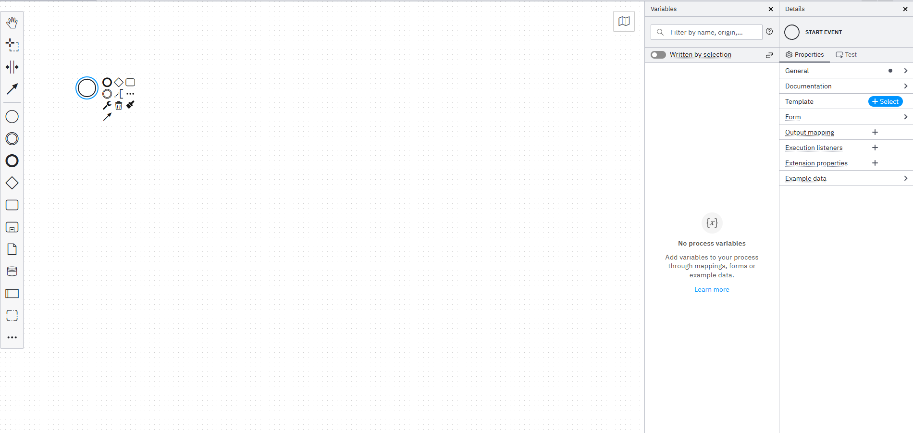
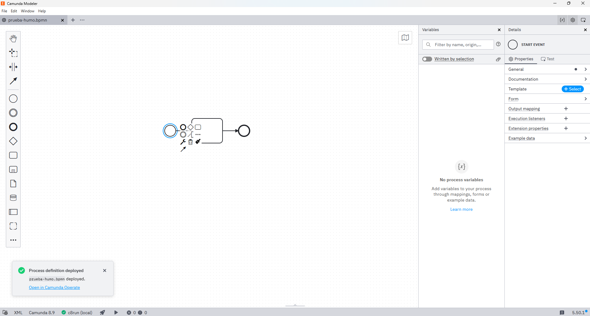
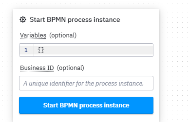
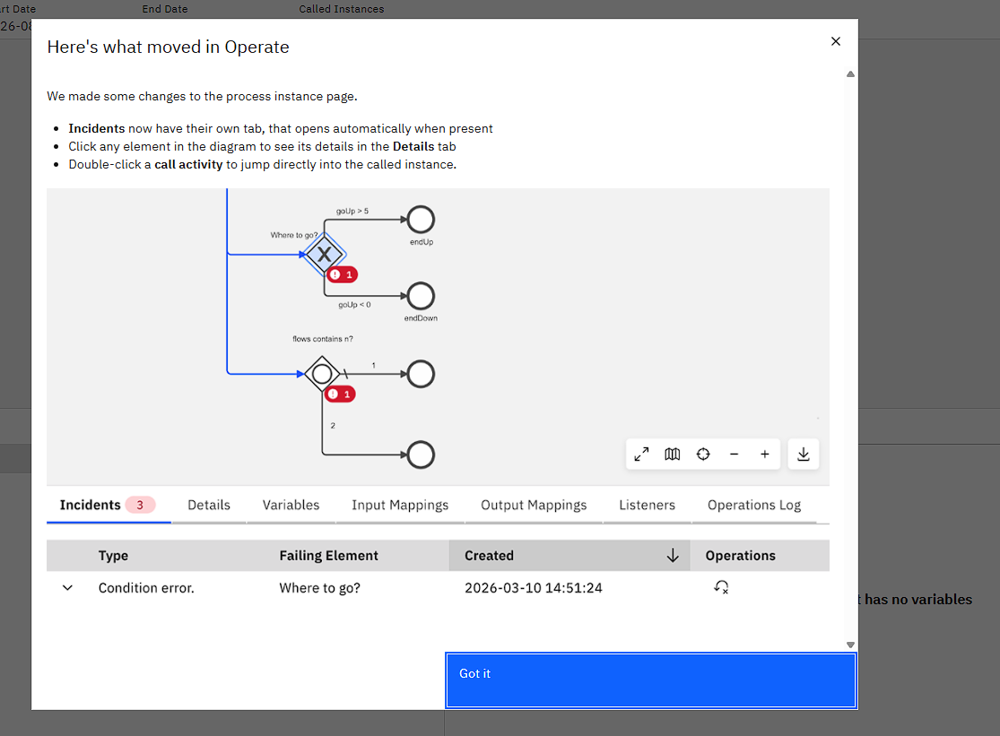
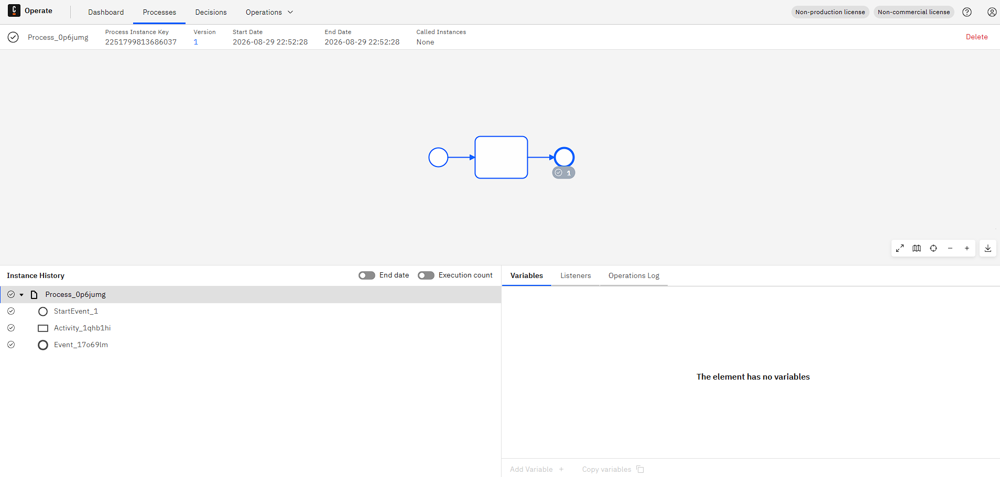

# Manual de instalación — Camunda 8 Run + Camunda Desktop Modeler

**Curso:** Informática Aplicada a los Negocios II — UCR 2026-G02, Grupo de investigación "Camunda + bpmn.io"
**Sistema operativo probado:** Windows 10/11 (x86_64)
**Fecha de instalación:** 29 de agosto, 2026

Este manual documenta, paso a paso y con evidencia real, la instalación del entorno Camunda 8 (motor Zeebe vía **Camunda 8 Run**) junto con el **Camunda Desktop Modeler** (aplicación oficial que empaqueta bpmn.io). Las capturas de pantalla propias de esta instalación se guardan en [`capturas/`](capturas/).

---

## 1. Requisitos previos

| Requisito | Versión instalada | Estado |
|---|---|---|
| OpenJDK | 21.0.6 LTS | ✅ Compatible (Camunda 8 Run soporta el rango 21–25) |

Verificar con el siguiente comando en PowerShell o terminal:

```bash
java -version
```

Salida esperada (similar a la obtenida en esta instalación):

```
java version "21.0.6" 2025-01-21 LTS
Java(TM) SE Runtime Environment (build 21.0.6+8-LTS-188)
Java HotSpot(TM) 64-Bit Server VM (build 21.0.6+8-LTS-188, mixed mode, sharing)
```

Si el comando no se reconoce o la versión no está en el rango soportado, instalar un OpenJDK 21 LTS (por ejemplo desde [adoptium.net](https://adoptium.net/)) antes de continuar.

---

## 2. Descargar Camunda 8 Run

**Fuente oficial:** https://downloads.camunda.cloud/release/camunda/c8run/8.9/

En esa página aparecen varios archivos según sistema operativo y arquitectura:

- `camunda8-run-8.9-darwin-aarch64.zip` → macOS (Apple Silicon)
- `camunda8-run-8.9-darwin-x86_64.zip` → macOS (Intel)
- `camunda8-run-8.9-linux-x86_64.tar.gz` → Linux
- `camunda8-run-8.9-windows-x86_64.zip` → **Windows (usar este)**

> ⚠️ **Error común (nos pasó a nosotros):** es fácil confundirse y descargar por error la versión `darwin` (macOS), ya que los nombres son parecidos. Los paquetes de macOS **no** incluyen el ejecutable `.exe` que necesita Windows. **Verificar siempre que el nombre del archivo contenga `windows-x86_64` antes de descomprimirlo.**

Descomprimir el `.zip` descargado. La ruta final queda, por ejemplo:

```
C:\Users\<usuario>\Downloads\camunda8-run-8.9-windows-x86_64\c8run-8.9.17
```


*Documentación oficial (docs.camunda.io) consultada para confirmar la versión estable (8.9) antes de descargar.*

---

## 3. Arrancar Camunda 8 Run

Abrir PowerShell y ubicarse en la carpeta descomprimida:

```powershell
cd "C:\Users\<usuario>\Downloads\camunda8-run-8.9-windows-x86_64\c8run-8.9.17"
```

Arrancar el entorno:

```powershell
.\c8run.exe start
```

Salida esperada (resumen):

```
Camunda has started successfully.
Access each component using the following URLs:

- Operate: http://localhost:8080/operate
- Tasklist: http://localhost:8080/tasklist
- Admin: http://localhost:8080/admin

Login with:
- Username: demo
- Password: demo
```

> ℹ️ **Nota:** el log de arranque puede mostrar `secondaryStorage.type=rdbms` en vez de `H2` (el valor por defecto documentado en versiones anteriores). No es un error: esta build simplemente usa otro tipo de almacenamiento secundario por defecto.

Al arrancar exitosamente, se abre automáticamente una ventana del navegador con Operate.

Para apagar el entorno de forma limpia cuando se necesite:

```powershell
.\c8run.exe stop
```

---

## 4. Verificar que los servicios están activos

Confirmar acceso y login (`demo` / `demo`) en las tres interfaces:

| Servicio | URL | Resultado esperado |
|---|---|---|
| Operate | http://localhost:8080/operate | Dashboard vacío, sin procesos (instalación limpia) |
| Tasklist | http://localhost:8080/tasklist | Vacío (instalación limpia) |
| Admin | http://localhost:8080/admin | Usuario `demo` visible |

---

## 5. Instalar Camunda Desktop Modeler

**Fuente oficial:** https://camunda.com/download/modeler/

En esa página descargar únicamente la tarjeta **"Desktop Modeler"** → botón **Windows (x64)**, versión **v5.50.1 (STABLE)**.

> ⚠️ **Aclaración:** en la misma página también aparecen "Getting Started Package" (bundle Modeler + Runtime, pero en versión *alpha* inestable), "Camunda 8 Run" (ya instalado en el paso 2) y "RPA Worker" (no aplica a este proyecto). Descargar solo la tarjeta **Desktop Modeler**.


*Tarjetas disponibles en camunda.com/download/modeler — usar solo "Desktop Modeler" (v5.50.1, STABLE).*

El instalador descargado puede no mostrar la extensión `.exe` en el explorador de Windows (por la configuración por defecto de Windows que oculta extensiones conocidas). El archivo llamado `Camunda Modeler` con tipo "Application" es el ejecutable correcto: doble clic para instalarlo/abrirlo.


*Contenido de la carpeta extraída: el archivo "Camunda Modeler" (tipo Application) es el ejecutable, aunque Windows no muestre su extensión `.exe`.*

Al abrir la aplicación por primera vez, la pantalla de bienvenida ofrece crear diagramas para **Camunda 8** o **Camunda 7**. Para este proyecto, usar siempre la columna **Camunda 8**.


*Pantalla de bienvenida: elegir siempre la columna "Camunda 8" → "BPMN diagram".*

---

## 6. Prueba de humo (smoke test)

Con Camunda 8 Run corriendo (paso 3) y el Modeler instalado (paso 5), se verificó el flujo completo modelado → despliegue → ejecución → monitoreo:

1. Crear un nuevo **BPMN diagram** (columna Camunda 8) desde la pantalla de bienvenida del Modeler.

   
   *Lienzo inicial con el Start Event por defecto y el context pad desplegado.*

2. El lienzo abre con un *Start Event* por defecto. Usando el **context pad** (menú contextual que aparece al seleccionar un elemento), se agregó:
   - Start Event → Task (ícono de rectángulo en el context pad) → End Event (ícono de círculo grueso)
3. Guardar el diagrama como `prueba-humo.bpmn` (`Ctrl+S`).
4. **Desplegar:** el botón de despliegue (ícono de cohete 🚀) está en la **barra de estado inferior** del Modeler, no en la esquina superior derecha como en otras versiones/herramientas.
5. Al desplegar, el Modeler detecta automáticamente la instancia local de Camunda 8 Run (se muestra como "c8run (local)" en la barra inferior). No fue necesario configurar manualmente ningún endpoint ni autenticación.
6. Confirmación recibida: *"Process definition deployed — prueba-humo.bpmn deployed."*

   
   *Diagrama Start → Task → End desplegado. La barra inferior confirma "Camunda 8.9" y "c8run (local)" detectados automáticamente.*

### Ejecutar una instancia de prueba

1. Desde el mensaje de éxito del despliegue, clic en **"Open in Camunda Operate"**.
2. En Operate, dentro de la vista del proceso, aparece el panel **"Start BPMN process instance"** (con campos opcionales de *Variables* y *Business ID*).

   
   *Panel "Start BPMN process instance" en Operate, con Variables y Business ID opcionales.*

3. Se inició la instancia dejando los campos por defecto (`{}` en variables, *Business ID* vacío).

   > ℹ️ En este punto puede aparecer un modal informativo de Operate sobre cambios recientes en la interfaz (por ejemplo, la pestaña dedicada de *Incidents*). No afecta la instancia creada; simplemente cerrarlo con **"Got it"**.
   >
   > 

4. **Resultado:** la instancia `Process_0p6jumg` se completó exitosamente — *Start Date* y *End Date* idénticos (ejecución instantánea, esperado por tratarse de una Task automática sin trabajo real). Los tres elementos del proceso (`StartEvent_1`, `Activity_1qhb1hi`, `Event_17o69lm`) muestran estado completado (✓) en el historial de la instancia.

   
   *Instancia `Process_0p6jumg` completada: los tres elementos del historial (StartEvent_1, Activity_1qhb1hi, Event_17o69lm) quedan marcados como completados.*

---

## 7. Video de instalación

> Obligatorio según el enunciado: enviarse al menos 3 días antes de la exposición (25 de septiembre), vía TEAMS o correo institucional con enlace.

- **Enlace:** _pendiente_
- **Fecha de publicación:** _pendiente_

---

## Conclusión

El entorno de **Camunda 8 Run (v8.9.17) + Camunda Desktop Modeler (v5.50.1)** quedó completamente funcional y verificado de punta a punta: modelado (bpmn.io vía Desktop Modeler) → despliegue → ejecución → monitoreo (Operate). Listo para comenzar el modelado del proceso real de negocio ("Pedido a Entrega") sobre este mismo entorno.
