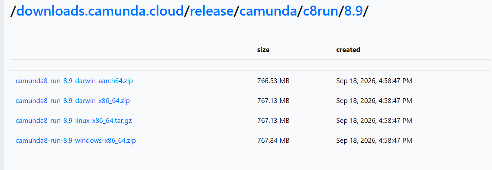
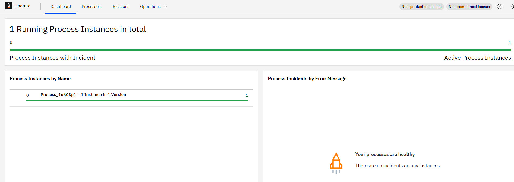
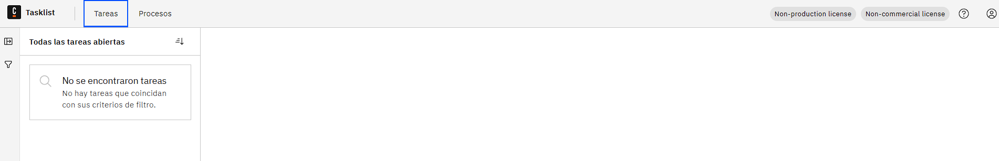
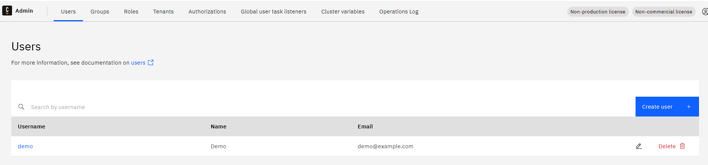
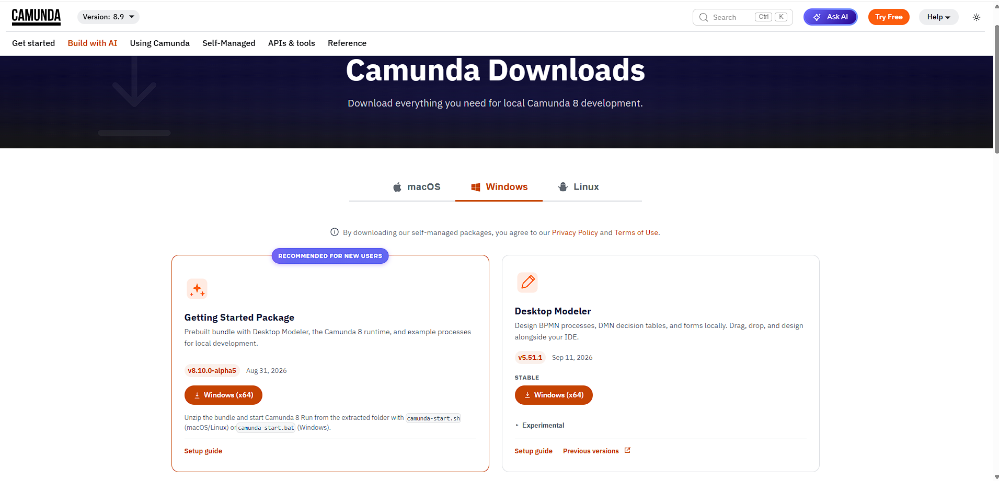

# Manual de instalación
### Camunda 8 Run + Camunda Desktop Modeler

---

## 1. Requisitos previos.

| Requisito | Versión instalada | Estado |
|---|---|---|
| **OpenJDK** | 21.0.6 LTS | Compatible (Camunda 8 Run soporta el rango 21–25) |

Verificar con el comando en PowerShell o terminal: **java-version**

**Salida esperada:**

```
java version "21.0.6" 2025-01-21 LTS
Java(TM) SE Runtime Environment (build 21.0.6+8-LTS-188)
Java HotSpot(TM) 64-Bit Server VM (build 21.0.6+8-LTS-188, mixed mode, sharing)
```

(SOLO SI NO ESTA INSTALADO)

Si no se tiene instalado por favor instalar el OpenJDK 21 LTS o similar antes de continuar.

https://www.oracle.com/java/technologies/javase/jdk21-archive-downloads.html

---

## 2. Descargar Camunda 8 Run.

Ingresa al siguiente link:

https://downloads.camunda.cloud/release/camunda/c8run/8.9/



En la página se debe elegir el archivo correspondiente a su sistema operativo.

Una vez descargado se procede a descomprimir el archivo .zip.

---

## 3. Arrancar Camunda 8 Run.

Ahora debes ubicar la carpeta descomprimida y abrir PowerShell o la consola en la ruta de la misma. En nuestro caso la ruta es la siguiente:

```
cd "C:\Users\<usuario>\Downloads\camunda8-run-8.9-windows-x86_64\c8run-8.9.17"
```

ahora se debe arrancar el entorno con el comando:

```
.\c8run.exe start
```

Salida esperada:

```
Camunda has started successfully.
Access each component using the following URLs:

- Operate: http://localhost:8080/operate
- Tasklist: http://localhost:8080/tasklist
- Admin: http://localhost:8080/admin

Login with:
- Username: demo
- Password: demo
```

Al arrancar exitosamente, se abre automáticamente una ventana del navegador con Operate.

---

## 4. Verificar que los servicios estén activos.

Confirmar acceso y login (demo / demo) en las siguientes URLs:

| Servicio | URL | Resultado esperado |
|---|---|---|
| **Operate** | http://localhost:8080/operate |  |
| **Tasklist** | http://localhost:8080/tasklist |  |
| **Admin** | http://localhost:8080/admin |  |

---

## 5. Instalar Camunda Desktop Modeler.

Fuente oficial: https://camunda.com/download/modeler/



En esta página se debe elegir el sistema operativo y descargar únicamente el "Desktop Modeler".

Una vez descargado se descomprime y abre la carpeta, dentro buscamos el archivo .exe y lo ejecutamos. Es posible que el explorador de Windows no muestre el .exe, por lo que vamos a buscar el archivo llamado "Camunda Modeler" con tipo "Application" es el ejecutable correcto: doble clic para instalarlo/abrirlo.


Al abrir la aplicación por primera vez, la pantalla de bienvenida ofrece crear diagramas para Camunda 8 o Camunda 7. Para este proyecto, usar siempre la columna Camunda 8. Para este caso elegir la opción de BPMN diagram.


Una vez creado el archivo del diagrama se debería ver así:


